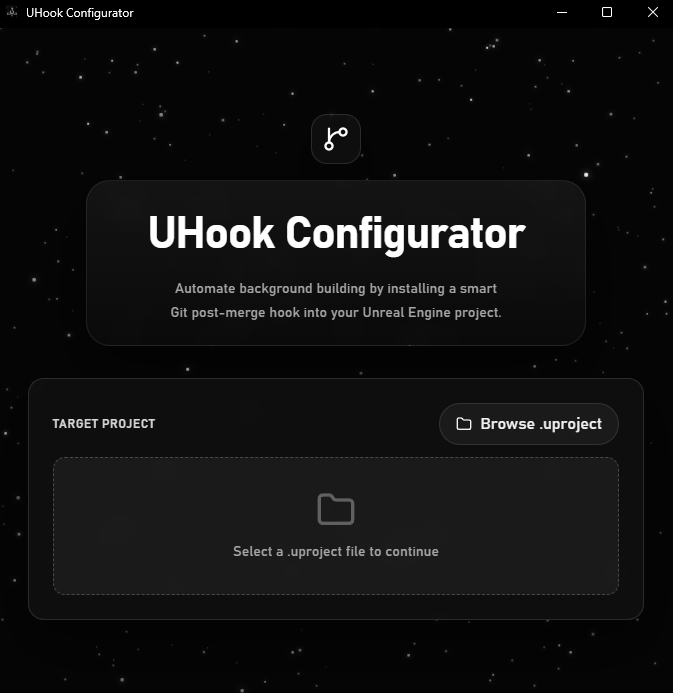

  
  <h1>UHook Configurator</h1>
  
<strong>A smart, zero-friction Git Hook installer for Unreal Engine artists and developers for autobuilding on pull.</strong>

 

  

## The Problem

In team environments using Unreal Engine, merging code changes via Git (or any Git GUI like Sourcetree/GitKraken) often breaks the Editor for non-programmers (artists, designers, animators). They get hit with the dreaded:

> *"Modules are missing or out of date. Would you like to recompile them?"*

This pop-up frequently fails or requires manual intervention with Visual Studio or `UnrealBuildTool` (UBT). Artists are forced to ask programmers for help just to open the project.

## The Solution

**UHook Configurator** solves this by installing a completely decoupled, "smart" Git post-merge hook into your local repository. 

Whenever you `git pull` or merge a branch:
1. The hook silently checks if any `/Source/` files, `.uplugin` files, or `.uproject` files were modified.
2. If only assets (textures, levels, blueprints) were changed, **it does nothing**.
3. If code *was* changed, it automatically fires up your specific version of `UnrealBuildTool` in the background and rebuilds the Editor binaries.
4. It logs the output to `build-logs/success` or `build-logs/failed` right in your project folder.

**Artists can keep using their favorite Git GUI. The build happens automatically because it's tied directly to the `.git` folder.**

## Features

- **Engine Auto-Detection:** Scans your Windows Registry and Epic Games Launcher data to automatically find where your Unreal Engine versions (including source builds) are installed.
- **Project Parsing:** Reads your `.uproject` to match the exact `EngineAssociation` with the correct `UnrealBuildTool.exe`.
- **Smart Hook Generation:** Injects a lightweight `post-merge` Bash script that only triggers when necessary.
- **Easy Removal:** Safely detect and remove existing hooks with one click.
- **Zero Dependencies:** A tiny (~9MB) standalone executable built with Rust and Tauri v2.

## Usage

1. Run `uhook-configurator.exe`.
2. Click **Browse .uproject** and select your Unreal Engine project.
3. The tool will verify your engine version and UBT path.
4. Click **Install Post-Merge Hook**.
5. You're done! Your repository will now automatically rebuild binaries when code is pulled.

## Tech Stack

- **Frontend:** React, TypeScript, Vite, Tailwind CSS
- **Backend:** Rust, Tauri v2
- **Key Crates:** `winreg` (Registry scanning), `serde_json` (Parsing Configs)

## Installation
Download the latest Windows Installer from the **Releases** tab.

*Requires Git to be initialized in your project (`.git` folder must exist).*
